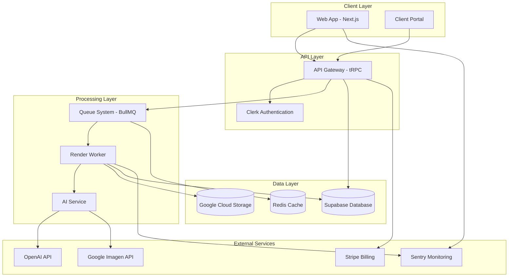
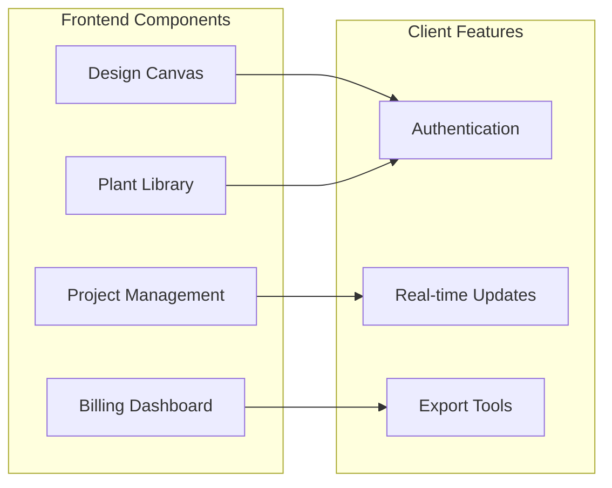
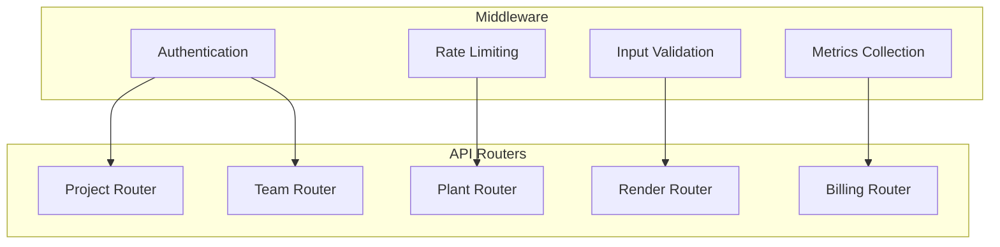
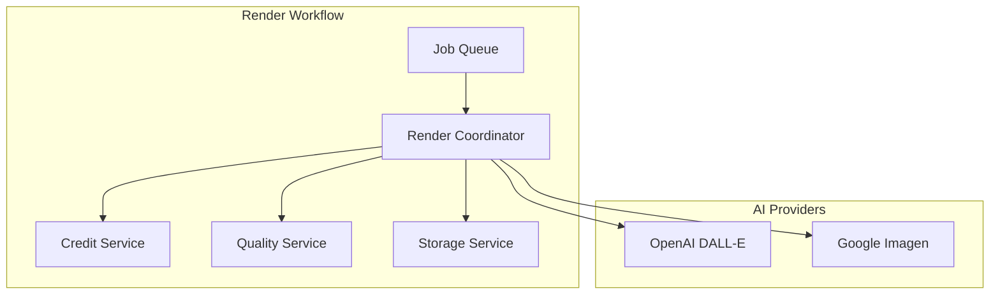
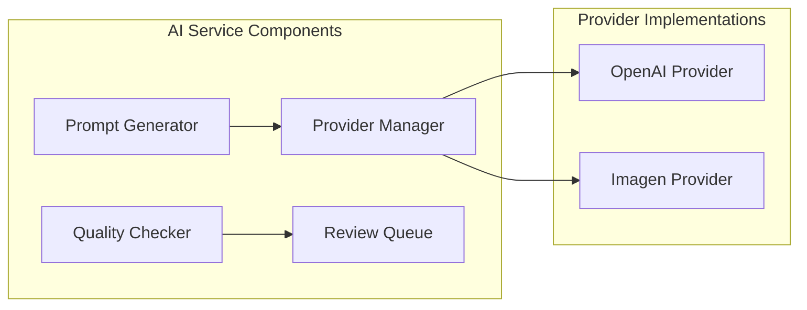
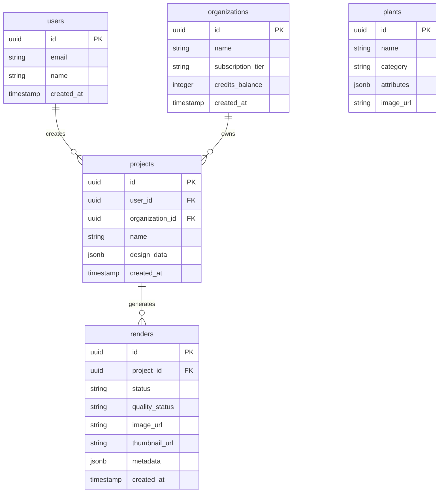
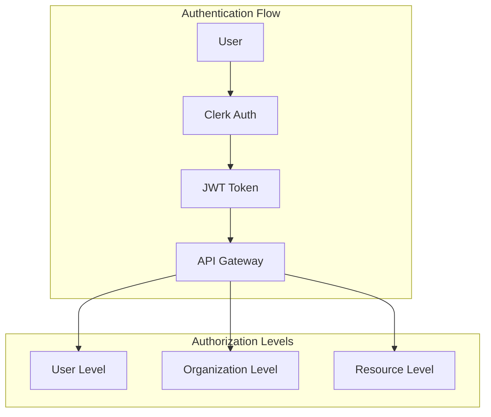
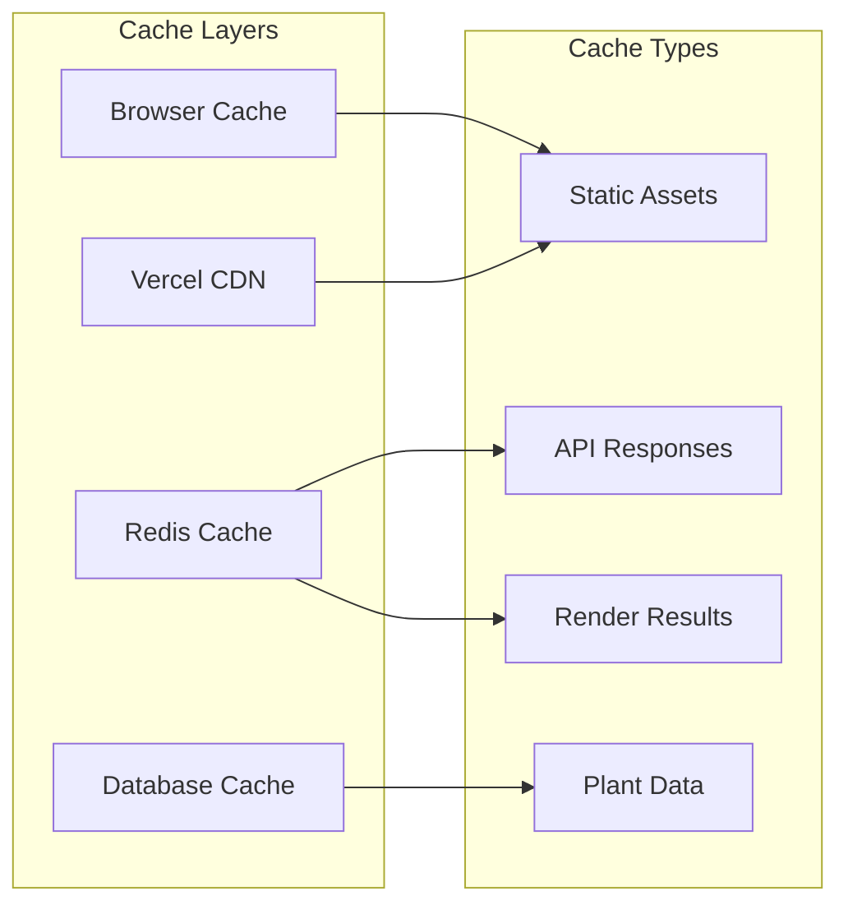
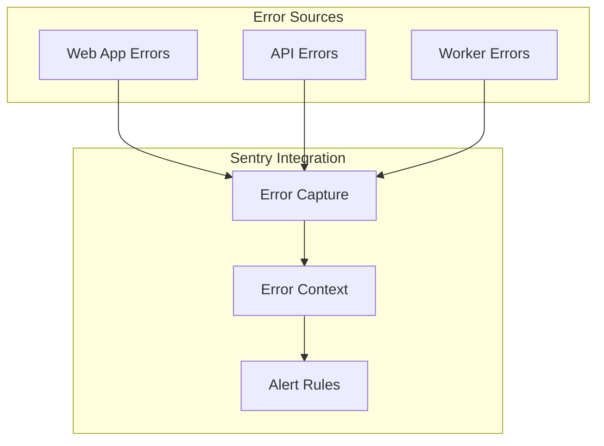
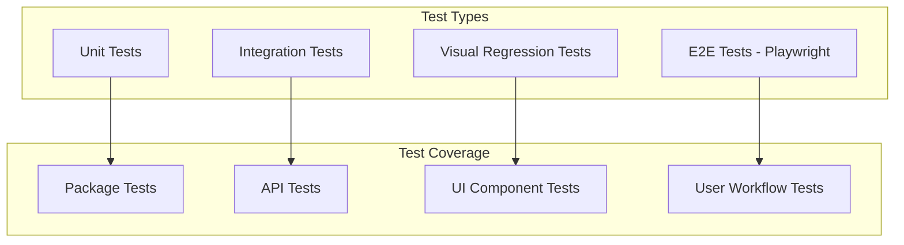

# TerraShaper Pro - System Architecture

## Overview

TerraShaper Pro is a modern landscape design platform built with a microservices-oriented monorepo architecture. The system enables users to create detailed landscape designs with AI-powered rendering capabilities.

## High-Level Architecture



## Monorepo Structure

```
TerraShaperPro/
├── apps/                           # Application workspaces
│   ├── web/                       # Next.js frontend application
│   ├── api-gateway/              # tRPC API gateway
│   └── render-worker/            # Background render processing
├── packages/                      # Shared packages
│   ├── ai-service/              # AI provider abstractions
│   ├── db/                      # Database utilities
│   ├── queue/                   # Queue management
│   ├── storage/                 # File storage utilities
│   ├── shared/                  # Common utilities
│   ├── scripts/                 # Build/deploy scripts
│   └── stripe/                  # Billing integration
└── docs/                         # Documentation
```

## Core Services Architecture

### 1. Web Application (Next.js)

**Purpose**: User-facing application with design tools and project management.



**Key Technologies**:
- Next.js 14 with App Router
- TypeScript
- Tailwind CSS
- Clerk Authentication
- tRPC Client

### 2. API Gateway (tRPC)

**Purpose**: Centralized API layer handling authentication, validation, and routing.



**Key Features**:
- Type-safe API contracts
- Automatic input validation
- Rate limiting and security
- Comprehensive error handling
- Metrics and monitoring

### 3. Render Worker (Background Processing)

**Purpose**: Handles AI-powered landscape rendering with quality control.



**Recent Refactoring** (423 LOC → 4 focused services):
- **CreditService**: Billing and credit operations
- **RenderStorageService**: GCS storage and thumbnail creation
- **RenderQualityService**: Quality checks and review queue
- **RenderCoordinator**: Orchestrates the complete workflow

### 4. AI Service Package

**Purpose**: Abstracts AI provider implementations with consistent interfaces.



## Data Architecture

### Database Schema (Supabase)



### File Storage (Google Cloud Storage)

```
gs://terrashaper-assets/
├── renders/
│   └── {project-id}/
│       ├── {render-id}.{format}
│       └── {render-id}_thumb.webp
├── plants/
│   └── {plant-id}/
│       ├── main.png
│       └── thumb.webp
└── projects/
    └── {project-id}/
        └── exports/
            └── {export-id}.{format}
```

## Security Architecture

### Authentication & Authorization



### Security Headers & Policies

- **CSP**: Strict content security policy
- **CORS**: Controlled cross-origin requests
- **Rate Limiting**: Per-user and per-endpoint limits
- **Input Validation**: Comprehensive data validation
- **RLS**: Row-level security in Supabase

## Performance & Scalability

### Caching Strategy



### Queue Processing

- **BullMQ**: Redis-backed job queue
- **Concurrency**: Configurable worker concurrency
- **Retry Logic**: Exponential backoff for failures
- **Monitoring**: Real-time queue metrics

## Monitoring & Observability

### Error Tracking (Sentry)



### Metrics Collection

- **Application Metrics**: Custom business metrics
- **Infrastructure Metrics**: Server and database performance
- **User Metrics**: Usage patterns and engagement
- **Queue Metrics**: Job processing statistics

## Development Workflow

### Package Management

- **npm workspaces**: Monorepo package management
- **Turbo**: Build system and task runner
- **TypeScript**: Strict type checking across packages
- **ESLint**: Consistent code style

### Testing Strategy



### Deployment

- **Vercel**: Frontend and API deployment
- **Google Cloud Run**: Worker deployment
- **Environment Promotion**: Staging → Production
- **Feature Flags**: Gradual feature rollouts

## Glossary

| Term | Definition |
|------|------------|
| **Render** | AI-generated landscape visualization |
| **Asset Instance** | Plant or material placed in design |
| **Design Canvas** | Interactive design workspace |
| **Quality Score** | AI-generated quality assessment (0-1) |
| **Credit Cost** | Billing units for operations |
| **Subscription Tier** | User plan level (starter/pro/growth) |
| **Perceptual Hash** | Image similarity detection hash |
| **Review Queue** | Manual quality review system |

## Architecture Decision Records (ADRs)

### ADR-001: Monorepo Structure
**Decision**: Use npm workspaces with Turbo for monorepo management
**Rationale**: Shared code reuse, consistent tooling, simplified dependency management

### ADR-002: tRPC for API Layer
**Decision**: Use tRPC instead of REST or GraphQL
**Rationale**: Type safety, reduced boilerplate, excellent TypeScript integration

### ADR-003: BullMQ for Job Processing
**Decision**: Use BullMQ for background job processing
**Rationale**: Redis-backed reliability, built-in retry logic, excellent monitoring

### ADR-004: Service-Oriented Refactoring
**Decision**: Break large files into focused service classes
**Rationale**: Improved maintainability, testability, and single responsibility principle

---

*This architecture documentation is maintained as a living document and updated with significant system changes.*