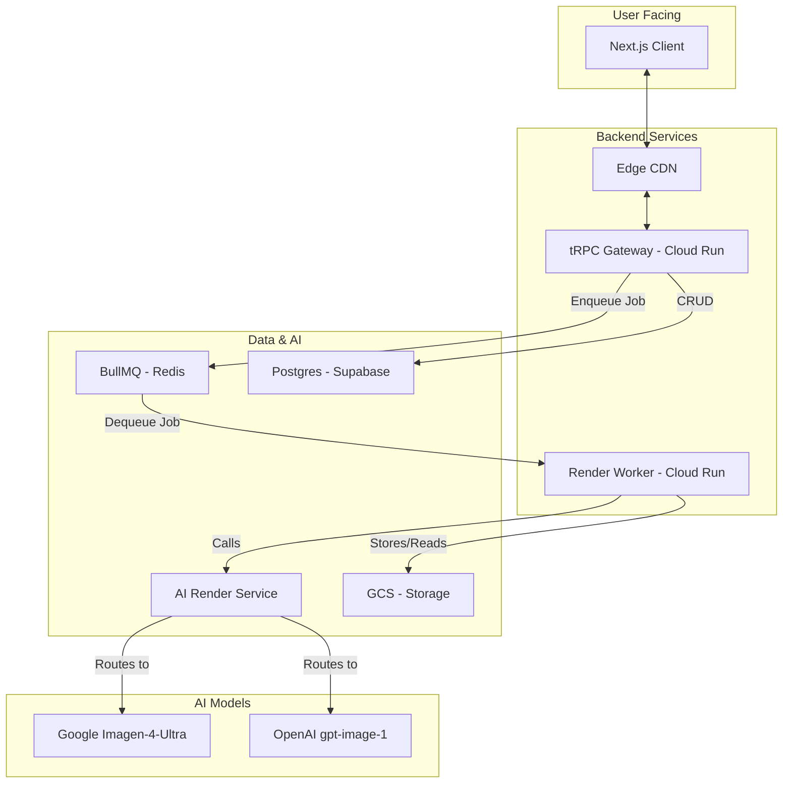
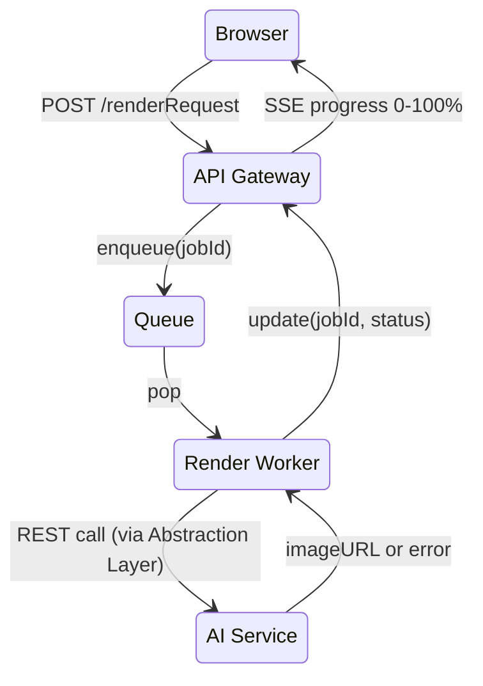

# TerraShaper Pro – Technical Requirements v2

---
**V2 Changelog (June 17, 2025):**
- **Architecture:** Decoupled the API Gateway from the background render jobs. Introduced a separate `Render Worker` service for better scalability and separation of concerns.
- **Prompt Engineering:** Replaced the static, generic prompt with a `Dynamic Prompt Generation` engine. This is a critical change to improve render quality and consistency.
- **Quality Assurance:** Enhanced the QA process from a vague "pixel-difference" to a concrete `pHash` analysis to detect unwanted image alterations.
- **AI Abstraction:** Introduced an `AI Render Service Abstraction Layer` to mitigate vendor lock-in with AI models.
- **Data Model:** Updated the ERD to include a `license` field for assets and a `prompt_hash` for renders to enable caching.
- **Risk Management:** Added a new risk for "Poor render quality" and strengthened the mitigation strategy for vendor lock-in.
- **AI Models:** Explicitly named `Google Imagen-4-Ultra` and `OpenAI gpt-image-1` as the initial supported models.
---

## 1. Product Scope & Objectives

### 1.1 Vision Statement & Strategic Goals

Deliver a **sub-60-second 4 K-render landscape-design SaaS** optimized explicitly for Texas landscaping contractors working in USDA hardiness zones 8a–9a. Our success metrics:

- **Render SLA**: 95% of 4 K renders completed in ≤60 seconds end-to-end (from request to storage). Latency logged and trended daily.
- **Adoption**: Onboard 20 pilot firms within 30 days of private beta launch, with a 70% engagement rate (≥5 project creations each).
- **Retention**: Achieve 80% monthly active usage among Starter and Pro subscribers after three months.

Core pillars:

1. **Instant-design Canvas**
   - Desktop-first sketching on site photos: drag-and-drop placement, polygon masks, and parametric tools. No local installs required; ideal for Windows/Mac browsers. (Mobile deferred to Phase 2.)
   - Live asset search powered by indexed tags (category, species, color, USDA zone).
   - **Onboarding flow**: Guided tooltips, optional interactive tutorial, and context-sensitive help links.
2. **Guaranteed 4 K Render ≤60 s**
   - Backend orchestration triggers Imagen‑4‑Ultra calls with optimized prompt templates. SLA measured at 4 points: queue time, API time, post-processing, CDN sync.
   - Auto-upscaling fallback via Real‑ESRGAN if vendor model degrades or size mismatch.
   - **Credits dashboard**: Real-time usage graph and projected monthly consumption.
3. **Right-sized Collaboration & Scalability**
   - Supports 1–30 seats in MVP with role-based ACL. Architecture built on multi-tenant Postgres schema; scales to 100+ seats by horizontal shard expansion.
   - **Team workflows**: Shared projects, version history, comments on renders.
   - **Enterprise readiness**: Audit logs, single sign-on (future), and tenant isolation.

### 1.2 Design Principles & Technical Alignments

- **Zero-learning-curve UX**
  - Home screen displays single large "Start Design" CTA. Inline tooltips, keyboard shortcuts cheat-sheet, and full searchable docs.
  - Contextual microcopy explains tool modes: polygon vs. polyline vs. asset.
- **Speed-first Operations**
  - Client bundle ≤200 KB gzipped, service-worker caches static assets. Initial TTI <1.2 s on LTE.
  - All synchronous interactions (e.g., create shape, move asset) target <150 ms.
  - Async tasks (render) offloaded to BullMQ queue with visible progress.
- **No Vendor Lock-in for Clients**
  - Users retain layered JSON exports of annotation objects and raw render PNGs.
  - Data export API with a stable, documented JSON Schema for project metadata and assets.
- **Compliance-by-design**
  - Exclude California geolocation sign-ups

### 1.3 Out-of-Scope (MVP)

- CAD exports (DXF, DWG, or Revit).
- Complex cost/estimator and BOM generation.
- AR/VR immersive walkthroughs.
- Mobile-optimized UI (Phase 2 backlog).
- California user onboarding, CCPA-specific flows, and localized consent banners.

---

## 2. Personas, Roles & Permissions

| Persona            | Primary Goals                                                        | Role Mapping | Key Pain Points Solved                              |   |   |   |
| ------------------ | -------------------------------------------------------------------- | ------------ | --------------------------------------------------- | - | - | - |
| **Business Owner** | Close deals faster, ensure team stays productive, see ROI on renders | *Owner*      | Slow client approvals, manual vendor quoting        |   |   |   |
| **Lead Designer**  | Iterate concepts, wow homeowners                                     | *Designer*   | Clunky Photoshop workflows, repeated plant searches |   |   |   |
| **Crew Lead**      | View final plan during install                                       | *Viewer*     | Reading architect blueprints, missing plant photos  |   |   |   |
| **Office Admin**   | Manage billing, seats, render credits                                | *Owner*      | Manual invoicing, budget overruns                   |   |   |   |

### Permission Matrix (delta vs previous)

- **Admin** (superset of Owner) added for future enterprise tier (RLS schema prepared).
- Granular project‑level ACLs implemented via row‑level policy in Supabase.

---

## 3. Functional Requirements

### 3.1 Project Lifecycle

1. **Create Project** → Name, client contact, site address (optional to avoid PII).
2. **Upload Scenes** → Accept JPEG/PNG/HEIC; server side converts HEIC → PNG; auto‑compress below 10 MP while storing original.
3. **Versioning** → Each render spawn creates new *version* record; view diff overlay.
4. **Archive/Restore** → Soft‑delete with 30‑day grace

### 3.2 Information Architecture & User Flows

#### 3.2.1 Information Architecture

**Level Structure & Key Objects:**

| Level | Purpose | Key Objects |
|-------|---------|-------------|
| **Account (subscription)** | Manages render quota (e.g., 18 / 20 renders remaining this month) | user, plan, quota |
| **Project** | One address-specific landscape job (e.g., 1221 Rockland Dr.) | scenes[], renders[], metadata |
| **Scene** | A single uploaded photo the user will annotate | sceneImage, masks[], renders[] |
| **Render** | The AI-generated 4K output for a scene | status, resolution, downloadURL |

#### 3.2.2 Primary User Flows

**Project Dashboard**
- Lists projects (card layout). "Back to Project View" link visible on inner pages.
- CTA: "Open Project" ⇒ Scene board.

**Scene Board (per project)**

*Base layout*
- Full‑width flex container with left thumbnail rail (fixed 140 px) and right workspace.
- Uses CSS Grid in mobile (single‑column) and flex split on ≥768 px.

*Thumbnail rail*
- Each Scene image rendered as 112 × 80 px rounded‑corner thumbnail.
- Thumbnails lazy‑load via next/image with blur‑up placeholder.
- Rail is vertically scrollable; native scrollbars hidden with ::-webkit-scrollbar but remain accessible.
- Current Scene has a 2 px brand‑primary outline and elevated shadow to stand out.
- Hover state reveals a mini‑toolbar containing Set Default, Duplicate, Delete icons.
- Drag‑and‑drop enabled via @dnd-kit; re‑ordering triggers POST /api/scene/reorder.
- Keyboard navigation: ↑ / ↓ moves focus; Enter selects focused scene.
- First cell is an Upload Drop‑zone with "＋ Add Image" icon; accepts JPEG/PNG ≤ 15 MB, ≥ 1500 × 1000 px.
- Validation errors surface as toast with precise reason (filetype, size, dimensions).
- Drop‑zone turns green on drag‑over, grey on invalid file.

*Global quota badge*
- Lives inside AppHeader top‑right; component QuotaBadge.tsx.
- Shows remaining renders, e.g., 18 / 20.
- Tooltip explains replenishment schedule and links to Upgrade Plan modal.
- Badge turns yellow at ≤25 % quota, red at 0 %; colors conform to WCAG contrast.
- Subscribes to quota.updated WebSocket so multiple tabs stay in sync.

*Breadcrumb & Toolbar*
- Breadcrumb path: Projects ▸ {ProjectName} ▸ Scene Board.
- Right‑side toolbar houses: Export Masks JSON, Download All Renders, Project Settings.
- Export downloads a zipped GeoJSON of all masks in project.
- Download All Streams a ZIP of every render in project via server‑side streaming.

*Empty‑state handling*
- If no scenes exist, workspace shows illustration and CTA Upload First Scene.
- Quota badge still visible; renders remain disabled until a scene is uploaded.

*Responsive behaviour*
- Below 768 px, thumbnail rail collapses into horizontal carousel above workspace.
- Drag‑and‑drop swaps to long‑press gesture on touch devices.
- Quota badge shrinks to icon + tooltip in mobile header.

*Accessibility*
- All thumbnails have alt text derived from scene filename or user label.
- Drag‑and‑drop operations announce reorder position via aria-live.
- Quota badge includes visually hidden text "renders remaining".
- Drop‑zone is focusable and operable via keyboard file picker.

**Annotation Workspace (current scene)**

*Category Tabs*
- Four primary tabs: Plants & Trees, Mulch & Rocks, Hardscape, Other; plus a hidden Custom tab revealed via settings.
- Each tab displays a pill counter of active masks (e.g., Trees 3). Counter animates on add/remove.
- Hovering reveals the colour‑swatch and a kebab‑menu to Rename, Merge into…, or Hide a category.
- Long‑press (≥600 ms) opens a colour‑picker modal allowing users to change the category accent; colour is persisted to user profile.
- Switching tabs filters mask visibility to that material class without resetting canvas zoom/pan.
- Keyboard navigation: ⌥ + ←/→ cycles tabs; ⌥ + Number (1‑4) jumps directly.

*Canvas & Mask Layer*
- Fabric.js canvas initialised at native scene resolution, scaled by devicePixelRatio for crispness on 4K displays.
- Optional 20 cm grid overlay toggled with G provides spatial reference; grid opacity 15%, colour adapts to scene luminance.
- "Snap‑to‑edge" helper magnetises new polygon vertices within 4 px of existing path endpoints to reduce micro‑gaps.
- Mask render order: category → creationTimestamp; re‑render is dirty‑rect optimised via requestAnimationFrame.
- Brush cursor previews diameter ring and crosshair at centre; jitter smoothing averages last 3 pointer positions.
- Performance budget: maintain < 16 ms frame budget; masks > 1000 auto‑thin with Douglas–Peucker ε = 0.8.
- High‑DPI export routine saves masks as GeoJSON + PNG sprite‑sheet (4096²) for backend ingestion.

*Tool Palette*
- Docked left vertical bar; collapses to icon‑only at < 1024 px width, accessible via slide‑out gesture.
- Mask (Polygon): click‑click‑click then Enter to close; Shift + Click adds vertex on existing edge.
- Mask (Brush): pressure‑sensitive on Apple Pencil / stylus; width slider 2–50 px with live preview.
- Pen (Freehand): Bézier smoothing factor 0.35; double‑tap toggles smoothing on/off.
- Select / Move tool appears once ≥ 1 mask exists; drag to reposition with snap enabled.
- Save button pulses after unsaved edits; disabled until ≥ 1 unsaved mask—tooltip "Nothing to save yet".
- Context tooltips describe modifier keys (e.g., Shift = constrain angle, Alt = subtract region).

*State Rules*
- Autosave diff patch every 60 s or on navigation; visual toast "Draft auto‑saved".
- Multi‑tab safety: tabId stored in mask metadata; concurrent save prompts merge dialogue.
- Soft‑delete: masks flagged deleted=true; hidden from canvas but restorable via history panel.
- Deleting the last mask of a category greys out its legend entry and unbolds the corresponding tab.

*Revision & History Panel*
- Toggled with H; right sidebar lists chronological edits with timestamp and author (future multi‑user).
- Each entry shows a 56 × 40 px diff thumbnail (red/green overlay) and brief action label (e.g., Added Mask).
- Clicking an entry restores that revision non‑destructively (creates a new history entry).

*Accessibility / ARIA*
- Canvas wrapper role="img" with dynamic aria‑label summarising selected masks and categories.
- Tab list uses proper WAI‑ARIA role="tablist"; active tab flagged with aria‑selected.
- Tool palette forms a toolbar with roving tabindex; shortcuts announced via aria‑keyshortcuts.

*Keyboard Shortcuts*
- M = Polygon tool, B = Brush, P = Pen, S = Select/Move, Esc = Cancel draw.
- Cmd + S = Save masks; Cmd + Z / Shift + Cmd + Z = Undo/Redo (max 20 steps).
- Cmd + D = Duplicate object.

### 3.3 Material Catalog Management

- **Material Categories**: Plants & Trees, Mulch & Rocks, Hardscape, Other (plus user-definable Custom category).
- **Material Database**: Curated list of landscaping materials organized by category, with descriptive names and metadata for AI prompt generation.
- **No Asset Images**: Unlike the old system, materials don't require thumbnail images since users draw masks directly on scene photos.


### 3.4 Render Request Flow

#### 3.4.1 Data Preparation

- **Scene Image**: Signed URL to the full-resolution scene photo (JPEG/PNG ≥ 4096×4096).
- **Masks**: Array of polygon masks with category assignments (Plants & Trees, Mulch & Rocks, Hardscape, Other). Each mask includes geometry data and material specifications.

#### 3.4.2 Dynamic Prompt Generation

The quality of the final render is critically dependent on the quality of the prompt. A generic prompt is insufficient. A **Prompt Templating Engine** will be developed to translate the structured `annotations` data into a rich, descriptive prompt for the generative model.

- **System Prompt** (static):
  > "You are a professional landscape visualization engine. Your task is to modify a source image based on specific instructions. Produce a natural, high-resolution 4K photograph by seamlessly integrating all requested landscaping elements. Pay close attention to matching the existing lighting, perspective, and shadows to create a cohesive, photorealistic scene."

- **Dynamic User Prompt** (generated from masks):
  The engine will iterate through the mask array and construct a narrative prompt based on category and material specifications.
  - **Example Input (JSON from canvas):**
    ```json
    [
      { "category": "Plants & Trees", "material": "Red Maple", "polygon": [[250, 400], [300, 450], [280, 500], [230, 480]] },
      { "category": "Mulch & Rocks", "material": "Black Mulch", "polygon": [[100, 200], [150, 250], [140, 300], [90, 280]] }
    ]
    ```
  - **Example Output (Generated Text):**
    ```text
    In the user-provided image, perform the following modifications. In the area defined by the first polygon mask, add mature Red Maple trees with vibrant autumn foliage. Fill the second polygonal area with Black Mulch material. Ensure all elements blend naturally with the existing lighting, shadows, and perspective. The final output should be a single, cohesive 4096×4096 image.
    ```

#### 3.4.3 API Payload & Abstraction

To avoid vendor lock-in, all model interactions will be routed through an internal **AI Render Service Abstraction Layer**. This layer is responsible for translating the generic prompt into the specific API format required by the chosen vendor. The initial implementation will support adapters for **Google Imagen-4-Ultra** and **OpenAI gpt-image-1**.

- **Example Payload (to internal service):**
  ```json
  {
    "sourceImageUrl": "gcs://bucket/scene-123.jpg",
    "maskImageUrl": "gcs://bucket/masks-123.png",
    "prompt": {
      "system": "You are a professional landscape visualization engine...",
      "user": "In the user-provided image, perform the following modifications..."
    },
    "output": { "format": "PNG", "resolution": [4096, 4096] }
  }
  ```

#### 3.4.4 Error Handling & Quality Assurance

- **Retries**: On transient errors, retry up to 2× with exponential backoff.
- **Smart Retries**: On the first failure, the prompt is slightly modified (e.g., appending "ensure high quality and photorealism") before the second attempt.
- **Quality Check**:
  - **Primary Check (Automated)**: Use a perceptual hash (pHash) to measure the perceptual distance between the original, unmasked image areas and the final render. If the hash distance exceeds a calibrated threshold, the render is flagged as a potential failure, as it indicates the model altered parts of the image it shouldn't have.
  - **Secondary Check (Future)**: For v1.2, develop a lightweight visual AI model to score renders on key criteria (e.g., artifacting, realism, prompt adherence).
- **Quota Enforcement**: Verify render quota before submission; return 402 with checkout link if exceeded.

---

## 4. Non‑Functional Requirements

- **Performance budgets**: JS bundle ≤ 200 KB gzipped; first contentful paint ≤ 1.1 s on LTE.
- **Accessibility**: WCAG 2.2 AA; color‑blind safe palette; keyboard shortcuts for every tool.
- **Internationalization**: I18n architecture ready; only en‑US strings initially. Currency localized via Stripe.
- **Disaster Recovery**: Daily Postgres WAL‑level backups; GCS bucket versioning 30 days; RTO 4 h, RPO 1 h.
- **Data Retention policy**: Delete soft‑deleted projects > 90 days; purge render job logs > 180 days.
- **Legal**: COPPA not applicable; GDPR minimal footprint but Data Processing Addendum kept in legal repo.

---

## 5. System Architecture

### 5.1 Macro Diagram

The system is composed of a Next.js client, a tRPC API Gateway, and a separate Render Worker service. This decouples the user-facing API from the resource-intensive rendering tasks, ensuring the application remains responsive.



### 5.2 Front-End Details

- **Leveraging shadcn/ui** & Tailwind.
- Zustand store in-memory; autosave throttled to backend whenever a stable internet connection is detected (simpler state layer).
- PWA manifest for installable experience; service‑worker caches catalog assets.

### 5.3 Back‑End Services & Queue Configuration

| Service        | Runtime           | Responsibility                                           | Autoscale Target |
| -------------- | ----------------- | -------------------------------------------------------- | ---------------- |
| API Gateway    | Node 20 (Fastify) | Type-safe tRPC endpoints for auth, project CRUD, assets. | CPU 70%          |
| Render Worker  | Node 20           | Processes `renderQueue` jobs from BullMQ, calls AI Service.  | CPU 70%          |
| Notification   | Node 20           | Email + in-app toast via Postmark.                       | Low              |

**Queue Setup (BullMQ)**

- **Redis**: hosted MemoryStore; single instance with failover.
- **Queue Name**: `renderQueue` with priority support.
- **Concurrency**: Render Worker instances each process up to 5 jobs in parallel.
- **Priority Rules**:
  - Job options include `priority` (integer 1–10). Assign `Starter` plan users priority `5`, `Pro` `3`, `Growth` `1` (lower number = higher priority).
  - If overall job wait time >120 s for Starter jobs, temporarily elevate their priority.
- **Rate-Limiting**:
  - Per-user and per-organization buckets (max 2 jobs/min for Starter, 10 jobs/min for Pro, 20 jobs/min for Growth).
  - Implemented via BullMQ throttler plugin.
- **Error Handling**: automatic retries up to 2×; backoff strategy: fixed 1 s.
- **Monitoring**:
  - Expose queue metrics (`waiting`, `active`, `completed`, `failed`) via Prometheus endpoint on `/metrics` for both Gateway and Worker.
  - Alerts if average wait time >60 s or failure rate >5 % over 10 min.

**Throughput Targets & Autoscaling**:

- **Per-Instance Throughput**: Each gateway instance (processing 5 concurrent jobs) handles ~150 renders/hour based on a 60 s average render time.
- **Scaling Configuration**:
  - Minimum instances: 2; Maximum instances: 20.
  - **Scale-Out Trigger**: Add an instance when `waiting` jobs >15 for 2 min.
  - **Scale-In Trigger**: Remove an instance when `waiting` jobs <5 for 5 min.
- **Hourly Capacity**: At max scale (20 instances), supports up to 3,000 renders/hour.
- **Rate-Limit Enforcement**: Enforce per-org burst limit of 10 jobs in any 1 min window, smoothing spikes.

**Dependency Cleanup**:

- Remove Python runtime and related Azure/Google client SDKs; use Node `@google-cloud/aiplatform` and `openai` libraries.
- Eliminate separate worker Dockerfile; single Docker image for tRPC gateway.
- Prune unused libraries (Fabric.js for front-end, no server-side image libs).

### 5.4 DevOps & CI/CD

- GitHub Actions: PR → unit & e2e tests (Playwright) → container build for Gateway and Worker → deploy to Cloud Run staging → Cypress smoke.
- Terraform provisions: Cloud Run services, Redis, SQL Instance, GCS buckets, Secret Manager.
- **Blue‑green deploys** to avoid downtime; feature flags via LaunchDarkly.

### 5.5 Data Model (full)

```mermaid
erDiagram
  users ||--o{ user_projects : "creates"
  projects ||--o{ scenes : contains
  scenes ||--o{ masks : has
  scenes ||--o{ renders : produces
  renders ||--|{ render_files : outputs
  masks }o--|| material_catalog : references
  audit_logs ||--|| users : actor

  users { uuid pk; email; role; stripe_customer_id; seat_group_id; render_quota }
  projects { id pk; name; address; metadata; created_at; updated_at }
  scenes { id pk; project_id fk; image_url; is_default; order_index }
  masks { id pk; scene_id fk; category; material; polygon jsonb; deleted boolean }
  material_catalog { id pk; category; name; tags text[]; metadata jsonb }
  renders { id pk; scene_id fk; status; cost_cents; generated_at; prompt_hash; prompt_text }
  audit_logs { id pk; actor_id; action; resource; diff jsonb; ts timestamptz }
```

- `audit_logs` enables GDPR‑style access logs; retained 1 y.
- `masks` stores polygon geometry with soft-delete support for history tracking.
- `material_catalog` replaces asset library, focusing on material types per category.
- `renders.prompt_hash` allows for caching/re-use of identical render requests.

---

## 6. External Services & Integrations (expanded)

| Service                    | Purpose               | Implementation Notes                                                        | Reliability Tier |
| -------------------------- | --------------------- | --------------------------------------------------------------------------- | ---------------- |
| Google Vertex AI           | Image Generation      | Primary provider (Imagen-4-Ultra). `gcloud` IAM service-account w/ min scopes. | Tier 1           |
| OpenAI API                 | Image Generation      | Secondary provider (gpt-image-1). Key rotation managed via Secret Manager.  | Tier 1           |
| Postmark                   | Transactional email   | DKIM & SPF configured on terrashaper.pro                                    | Tier 2           |
| LaunchDarkly               | Feature flags         | Free tier fits ≤10 flags for MVP                                            | Tier 3           |
| Sentry                     | Error/APM             | Release health dashboards                                                   | Tier 2           |

---

## 7. Rendering Workflow & State Machine (detailed)



**UX nuance**: Browser receives server‑sent events every 2 s; displays progress bar. If job fails, dialog shows "Retry" which enqueues again unless attempts ≥3.

### Retry/Refund Logic

- Attempt 1 → Full price credit.
- Attempts 2–3 → Free; no additional credit consumed.
- After 3 × error, status `permanent_fail`; user emailed & credit automatically restored.

---

## 8. Observability & Monitoring

- **Metrics** collected via OpenTelemetry → Cloud Monitoring.
  - `render_latency_ms`, `render_fail_ratio`, `credits_consumed_total`.
- **Tracing** for distributed latency across API → Worker → Imagen.
- Dashboards: Grafana (Stackdriver data‑source) with p50/p95/p99.
- **Alerting policies**: PagerDuty integration; on‑call rotation defined.

---

## 9. Security & Compliance Addenda

- JWT length limited to 512 chars; rotated every 24 h.
- Bcrypt password cost 12; Argon2 considered for v1.
- Secrets stored in Google Secret Manager; accessed via Workload Identity.
- **PII minimization**: Address, phone optional; if entered, stored encrypted column.
- **Children images** – TOS prohibits under‑13 facial inclusion to avoid COPPA.
- Annual penetration test budgeted ($5 K) prior to v1.1.

---

## 10. Risk Register (expanded)

| ID   | Risk                                    | Likelihood | Impact | Response                                                                                                                                                                                                                               | Owner        |
| ---- | --------------------------------------- | ---------- | ------ | -------------------------------------------------------------------------------------------------------------------------------------------------------------------------------------------------------------------------------------- | ------------ |
| R‑01 | AI Vendor Lock-in / Price Hike >25%     | Med        | High   | **Mitigation**: The AI Render Service Abstraction Layer is in place from day one. It will be built with adapters for both Google Imagen-4 and OpenAI gpt-image-1, allowing for rapid, programmatic switching. | CTO          |
| R‑02 | GPU quota exhaustion                    | Low        | Med    | Multi‑region GPU quotas; proactive GPU‑usage dashboard; PagerDuty alert at > 75 % usage; per‑user & per‑org rate‑limiting; BullMQ queue prioritizes Starter plan if Pro users over‑consume.                                   | DevOps       |
| R‑03 | Feature creep (cost estimator requests) | High       | Med    | Roadmap gatekeeping; maintain MoSCoW backlog.                                                                                                                                                                                          | PM           |
| R‑04 | Plant catalog rights issues             | Low        | Low    | Use royalty‑free/owned images; track `license` field in `assets` table.                                                                                                                                                        | Legal        |
| R‑05 | Texas drought imagery outdate           | Med        | Low    | Quarterly asset review cycle; auto flag low‑usage assets                                                                                                                                                                       | Content Lead |
| R‑06 | Poor render quality / "bad results"     | Med        | High   | **Mitigation**: Invest heavily in Dynamic Prompt Generation engine. Implement pHash-based QA checks. Manually review first 1,000 renders from beta users to fine-tune prompts and QA thresholds.                               | Product      |

---

## 11. Release Roadmap (phased)

| Phase            | Timing   | Milestones                                                                                 | Key Deliverables                        |
| ---------------- | -------- | ------------------------------------------------------------------------------------------ | --------------------------------------- |
| Alpha (Internal) | Wks 1-2  | Scene upload, annotation save/load, Vertex call returns dummy image.                       | Dev‑only release on staging             |
| Private Beta     | Wks 3–5  | Stripe Starter plan, 2K renders, 10 pilot landscapers, feedback surveys.                   | Loom onboarding vids, feedback surveys  |
| **MVP GA**       | Wks 6–20 | 4K renders, PWA install, public marketing site, billing support.                           | SLA docs, marketing site                |
| v1.1             | +6 wks   | Batch render, seat management, custom asset uploads.                                       | Press release, upgrade migration script |
| v1.2             | +4 wks   | Advanced QA model, offline mode (local caching & deferred sync).                           | Admin moderation UI                     |
| v2.0             | +12 wks  | CA rollout, AR viewer, AI plant recommender.                                               | iOS App Store listing                   |

---

*Prepared June 18, 2025 – This expanded draft (v2) supersedes all previous versions. Review acceptance by 06/20 EOD.*

